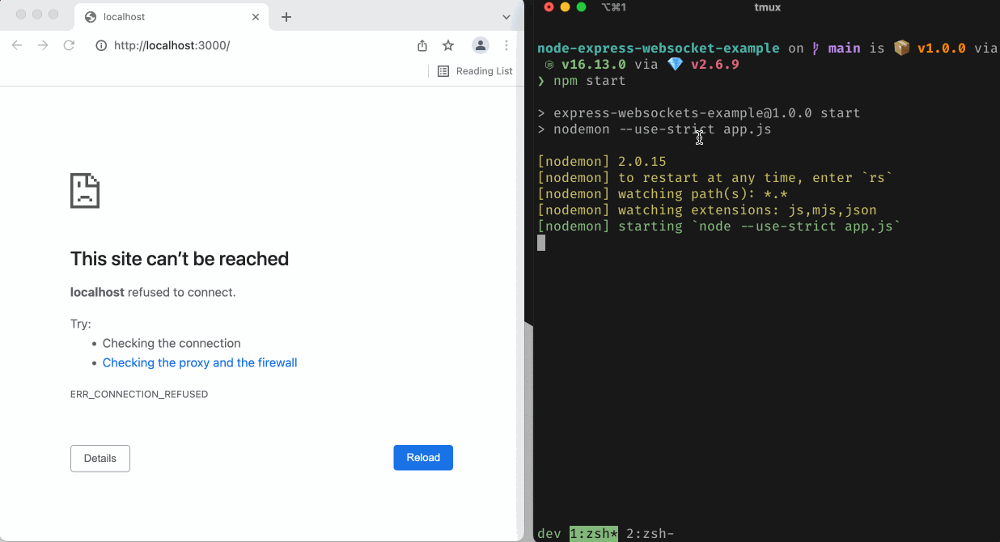

# node-express-websocket-example

A simple websocket server example using [express](https://expressjs.com) and [ws](https://github.com/websockets/ws). 

The server simply replies to all messages with "Reply to <YOUR_MESSAGE>".

## Getting started

1. Clone repo
1. install dependencies: `npm install`
1. start server: `npm start`

Use browser developer tools for websocket connection and sending messages:

1. visit http://localhost:3000 and open developer console
1. `ws = new WebSocket('ws://localhost:3000')`
1. `ws.send('Hello')`
1. See network tab for messages

